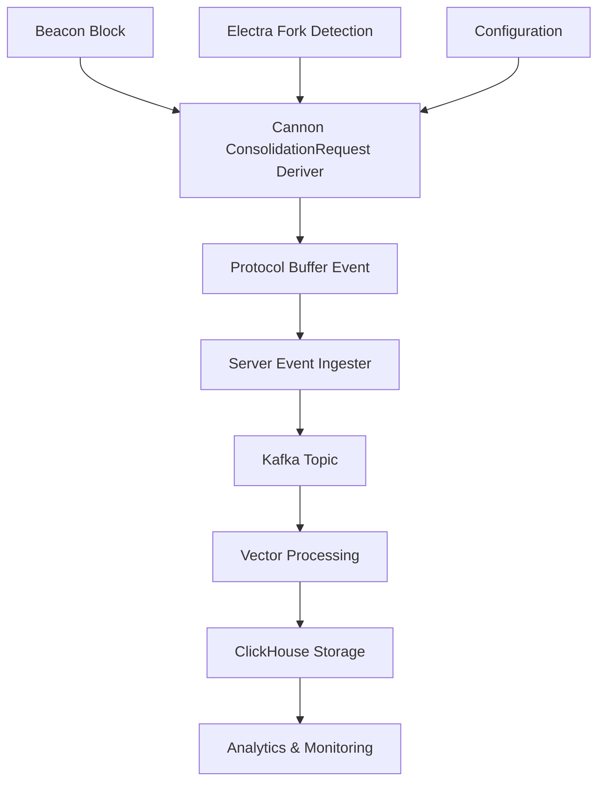

# Plan for Consolidation Requests Iterator Implementation

## Executive Summary

This plan outlines the implementation of a new Xatu Cannon iterator that derives `consolidation_requests` from Ethereum beacon blocks starting from the Electra fork. The implementation follows EIP-7251 specifications and requires end-to-end integration through the entire Xatu pipeline: Cannon → Server → Kafka → Vector → ClickHouse.

### Problem Context
With the Electra fork (EIP-7251), Ethereum introduces consolidation requests as part of execution requests, allowing validators to consolidate their stakes. Xatu needs to capture and process these requests to provide comprehensive network monitoring and analytics.

### BIG PICTURE Overview


The consolidation request contains:
- `source_address`: ExecutionAddress
- `source_pubkey`: BLSPubkey  
- `target_pubkey`: BLSPubkey

These requests are part of the `ExecutionRequests` container in beacon block bodies, alongside deposits and withdrawals.

## Detailed Plan

### Architecture Integration Points

1. **Cannon Layer**: Create a new iterator/deriver that extracts consolidation requests from beacon blocks
2. **Protocol Buffers**: Already defined in `/pkg/proto/eth/v1/execution_requests.proto`
3. **Server Layer**: Implement event handler for consolidation request events
4. **Kafka**: Configure topic routing for consolidation request events  
5. **Vector**: Add processing pipeline for new event type
6. **ClickHouse**: Create database schema and migration for storage

### Data Flow Sequence

1. Cannon iterator processes slots from Electra fork onwards
2. For each block, extract `ExecutionRequests.consolidations` 
3. Create individual events for each consolidation request
4. Events flow through server → kafka → vector → clickhouse
5. Data becomes queryable for analytics and monitoring

## Dependencies

### Internal Dependencies
- Protocol buffers already defined (`ElectraExecutionRequestConsolidation`)
- Cannon infrastructure (iterators, derivers, configuration)
- Server event ingester framework
- Kafka topic management
- Vector processing pipelines
- ClickHouse migration system

### External Dependencies  
- Beacon client with Electra support
- Electra fork activation on target network
- ClickHouse cluster availability

## Assumptions

1. **Fork Detection**: Existing fork detection mechanisms work for Electra
2. **Block Structure**: Beacon blocks expose consolidation requests via standard API
3. **Performance**: Consolidation requests volume is manageable within current infrastructure
4. **Configuration**: Standard deriver configuration patterns apply
5. **Migration**: Standard ClickHouse migration process works for new tables

## Detailed Breakdown

### 1. Cannon Iterator/Deriver Implementation

**Pattern**: Follow existing deriver structure in `/pkg/cannon/deriver/beacon/eth/v2/`

**Key Components:**
- `ConsolidationRequestDeriver` struct
- Configuration with `Enabled` flag and iterator config
- `ActivationFork()` returns `spec.DataVersionElectra`
- Standard processing loop: epoch → slot → block → extract → event

**Reference Files:**
- `/pkg/cannon/deriver/beacon/eth/v2/deposit.go` (similar request type)
- `/pkg/cannon/deriver/beacon/eth/v2/withdrawal.go` (similar structure)

### 2. Server Event Handler Implementation

**Pattern**: Follow beacon block event handler structure in `/pkg/server/service/event-ingester/event/beacon/eth/v2/`

**Key Components:**
- `BeaconBlockConsolidationRequest` struct
- Type constant: `BEACON_API_ETH_V2_BEACON_BLOCK_CONSOLIDATION_REQUEST`
- Standard validation, filtering, and metadata appending

**Reference Files:**
- `/pkg/server/service/event-ingester/event/beacon/eth/v2/beacon_block_deposit.go`
- `/pkg/server/service/event-ingester/event/beacon/eth/v2/beacon_block_withdrawal.go`

### 3. ClickHouse Schema Design

**Table Structure**: Based on analysis of recent migrations and consolidation request fields

```sql
CREATE TABLE canonical_beacon_consolidation_request_local ON CLUSTER '{cluster}'
(
    unique_key Int64,
    updated_date_time DateTime CODEC(DoubleDelta, ZSTD(1)),
    event_date_time DateTime64(3) CODEC(DoubleDelta, ZSTD(1)),
    block_slot UInt32 CODEC(DoubleDelta, ZSTD(1)),
    block_slot_start_date_time DateTime CODEC(DoubleDelta, ZSTD(1)),
    block_epoch UInt32 CODEC(DoubleDelta, ZSTD(1)),
    block_epoch_start_date_time DateTime CODEC(DoubleDelta, ZSTD(1)),
    position_in_block UInt32 CODEC(DoubleDelta, ZSTD(1)),
    block_root FixedString(66) CODEC(ZSTD(1)),
    source_address FixedString(42) CODEC(ZSTD(1)),
    source_pubkey FixedString(98) CODEC(ZSTD(1)), 
    target_pubkey FixedString(98) CODEC(ZSTD(1)),
    -- Standard meta fields...
    meta_client_name LowCardinality(String),
    meta_network_name LowCardinality(String),
    -- ... other meta fields
) ENGINE = ReplicatedReplacingMergeTree(...)
```

### 4. Vector Pipeline Configuration

**Pattern**: Add new kafka source and ClickHouse sink following existing beacon block patterns

**Configuration Addition**:
```yaml
sources:
  beacon_api_eth_v2_beacon_block_consolidation_request_kafka:
    type: kafka
    bootstrap_servers: "${KAFKA_BROKERS}"
    group_id: xatu-vector-kafka-clickhouse-consolidation-requests
    topics:
      - "beacon-api-eth-v2-beacon-block-consolidation-request"
```

## Tasks

### Phase 1: Core Implementation

1. **Create ConsolidationRequest Deriver**
   - File: `/pkg/cannon/deriver/beacon/eth/v2/consolidation_request.go`
   - Implement standard deriver interface
   - Set activation fork to Electra
   - Extract consolidation requests from beacon blocks
   - Generate events with position tracking

2. **Update Cannon Configuration**
   - Add `ConsolidationRequestConfig` to `/pkg/cannon/deriver/config.go`
   - Add configuration parsing and validation
   - Enable/disable flag support

3. **Create Server Event Handler**
   - File: `/pkg/server/service/event-ingester/event/beacon/eth/v2/beacon_block_consolidation_request.go`
   - Implement event validation and processing
   - Follow established patterns from deposit/withdrawal handlers

4. **Update Protocol Buffer Integration**
   - Ensure proper integration with existing `ElectraExecutionRequestConsolidation` 
   - Add event type constants and registration

### Phase 2: Data Pipeline Configuration

5. **Create ClickHouse Migration**
   - File: `/deploy/migrations/clickhouse/062_consolidation_requests.up.sql`
   - Create local and distributed tables
   - Include proper indexing and partitioning
   - Follow established naming conventions

6. **Update Vector Configuration**
   - Modify `/deploy/local/docker-compose/vector-kafka-clickhouse.yaml`
   - Add kafka source for consolidation request events
   - Add ClickHouse sink configuration
   - Configure topic routing

7. **Update Kafka Topic Management**
   - Ensure topic creation for `beacon-api-eth-v2-beacon-block-consolidation-request`
   - Configure appropriate retention and partitioning

### Phase 3: Integration and Testing

8. **Integration Testing**
   - Test end-to-end flow: cannon → server → kafka → vector → clickhouse  
   - Verify Electra fork activation behavior
   - Test with actual beacon blocks containing consolidation requests

9. **Configuration Documentation**
   - Update configuration examples
   - Document new deriver settings
   - Add troubleshooting notes

10. **Performance Validation**
    - Monitor processing performance
    - Validate ClickHouse query performance
    - Ensure no bottlenecks in pipeline

### Phase 4: Production Readiness

11. **Error Handling and Logging**
    - Comprehensive error handling
    - Appropriate log levels and messages
    - Monitoring and alerting considerations

12. **Migration Testing**
    - Test migration on development environment
    - Validate rollback procedures
    - Document deployment steps

## Context

### Related Files and Code References

**Cannon Implementation:**
- `/pkg/cannon/deriver/beacon/eth/v2/deposit.go` - Similar execution request type
- `/pkg/cannon/deriver/beacon/eth/v2/withdrawal.go` - Similar structure and patterns
- `/pkg/cannon/deriver/config.go` - Configuration patterns
- `/pkg/cannon/iterator/backfilling_checkpoint_iterator.go` - Iterator mechanics

**Server Implementation:**
- `/pkg/server/service/event-ingester/event/beacon/eth/v2/beacon_block_deposit.go` - Event handler pattern
- `/pkg/server/service/event-ingester/event/beacon/eth/v2/beacon_block_withdrawal.go` - Similar request handling

**Protocol Buffers:**
- `/pkg/proto/eth/v1/execution_requests.proto` - Already contains `ElectraExecutionRequestConsolidation`

**Infrastructure:**
- `/deploy/migrations/clickhouse/024_cannon_elaborated_attestation.up.sql` - Recent migration pattern
- `/deploy/local/docker-compose/vector-kafka-clickhouse.yaml` - Vector configuration

**Configuration Examples:**
- `example_cannon.yaml` - Cannon configuration reference

### EIP-7251 Specification Context

The consolidation request implementation must align with EIP-7251:
- Part of `ExecutionRequests` container
- Available from Electra fork onwards
- Contains validator consolidation operations
- Critical for network monitoring and validator analytics

## Risk Mitigation

### Technical Risks
1. **Fork Activation**: Test thoroughly with Electra testnet
2. **Performance Impact**: Monitor processing overhead
3. **Data Volume**: Plan for potential high volume of consolidation requests

### Operational Risks  
1. **Migration Failures**: Test migrations extensively
2. **Pipeline Bottlenecks**: Monitor kafka and vector performance
3. **Storage Growth**: Plan ClickHouse storage capacity

### Deployment Strategy
1. Deploy to testnet first
2. Gradual rollout with monitoring
3. Rollback plan for each component
4. Performance benchmarking at each stage